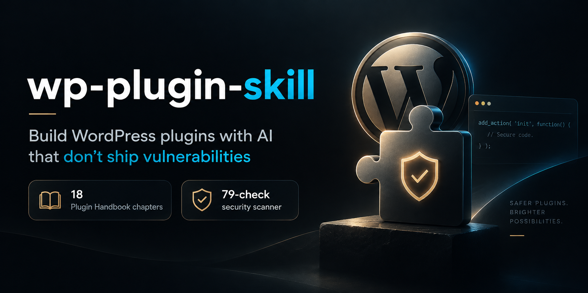

<div align="center">

<p align="center">
  
</p>

<br>

# wp-plugin-skill

**Build WordPress plugins with AI that don't ship vulnerabilities.**

A skill that teaches Claude the full [WordPress Plugin Handbook](https://developer.wordpress.org/plugins/) — all 18 chapters — plus the security model behind nearly every plugin CVE.

[](LICENSE)
[](https://developer.wordpress.org/plugins/)
[](https://claude.com/claude-code)
[](#contributing)

[Install](#install) · [What changes](#what-changes) · [Coverage](#coverage) · [Scanner](#the-scanner) · [FAQ](#faq)

</div>

---

## The problem

Ask any AI to "add an AJAX handler that saves settings" and you will usually get this:

```php
add_action( 'wp_ajax_save_settings', 'save_settings' );
add_action( 'wp_ajax_nopriv_save_settings', 'save_settings' );

function save_settings() {
    update_option( $_POST['name'], $_POST['value'] );
    echo $_POST['message'];
    wp_die();
}
```

It works. It also hands **any visitor on the internet** full control of the site — set `default_role` to `administrator`, enable registration, sign up, done. Plus reflected XSS and an unprefixed function name that will collide with the next plugin.

Every one of those is a real, catalogued vulnerability class that appears in WordPress plugin CVEs every week.

## What changes

With the skill loaded, the same request produces:

```php
add_action( 'wp_ajax_myplugin_save_settings', 'myplugin_save_settings' );
// No nopriv variant — this is not a public action.

function myplugin_save_settings() {
    if ( ! current_user_can( 'manage_options' ) ) {              // Gate 2: authorization
        wp_send_json_error( array( 'message' => __( 'Forbidden', 'my-plugin' ) ), 403 );
    }
    check_ajax_referer( 'myplugin_save_settings', 'nonce' );      // Gate 3: intent

    $allowed = array( 'myplugin_color', 'myplugin_layout' );     // allowlist, not arbitrary
    $name    = sanitize_key( $_POST['name'] ?? '' );

    if ( ! in_array( $name, $allowed, true ) ) {
        wp_send_json_error( array( 'message' => __( 'Invalid option', 'my-plugin' ) ), 400 );
    }

    update_option( $name, sanitize_text_field( wp_unslash( $_POST['value'] ?? '' ) ) );

    wp_send_json_success( array( 'name' => $name ) );
}
```

And before writing it, Claude asks the one thing it cannot infer:

> Before I build this — who should be able to change these settings?
> 1. **Administrators only** (`manage_options`) — safest default
> 2. Editors and above (`edit_others_posts`)
> 3. Any logged-in user (`read`)
>
> I'd suggest 1 unless these are per-user preferences.

## Why it works

Three ideas do most of the work.

### 1. Every entry point needs three gates

Nearly every plugin CVE is a missing gate, not an exotic exploit.

```
Gate 1  AUTHENTICATION  Is this a logged-in user?      is_user_logged_in()
Gate 2  AUTHORIZATION   May THIS user do THIS thing?   current_user_can( 'cap' )
Gate 3  INTENT          Did they mean to, right now?   check_admin_referer()
Then    INPUT           Sanitize + validate every request value
Then    OUTPUT          Escape at the point of printing, per context
```

A nonce without a capability check is not security — it only proves the request came from your form, not that the user is allowed. A capability check without a nonce is CSRF-able. You need both.

### 2. It asks instead of guessing

Some decisions cannot be read off a request, and guessing them produces a plugin that is wrong in a way you find out about in production. **Who** may do this, whether an endpoint is public, where data lives, whether uninstall deletes user data — these get a question with concrete options and a recommendation, *before* the affected code is written.

If you don't answer, it picks the **most restrictive** option that meets the request and tells you what it chose. A too-tight permission is a support request; a too-loose one is a CVE.

It does **not** ask about sanitizing, escaping, nonces, or prefixing. Those are never optional.

### 3. Progressive disclosure

23 reference files, ~5,600 lines. Claude loads only what the current task needs — the metadata reference when you touch post meta, the cron reference when you schedule a task. Depth without drowning the context window.

## Install

```bash
# Project-level — this project only
git clone https://github.com/ararai1991/wp-plugin-skill .claude/skills/wp-plugin-skill

# User-level — every project on your machine
git clone https://github.com/ararai1991/wp-plugin-skill ~/.claude/skills/wp-plugin-skill
```

That's it. The skill activates automatically when you work on WordPress plugin code — no command to remember.

**Requirements:** [Claude Code](https://claude.com/claude-code) or any agent runtime that reads `SKILL.md` files. The scanner additionally wants `bash` (and uses `ripgrep` when available, `grep` otherwise).

## Try it

```
"Build a plugin that lets editors manage a book catalog with ISBN and genre"
"Add a REST endpoint for fetching items, paginated"
"Review this plugin for security issues"
"Why does my custom post type 404 after activation?"
"Get this plugin ready for the WordPress.org directory"
```

## Coverage

Every chapter of the Plugin Handbook, plus the security, performance, and database material that plugins actually fail on.

<table>
<tr><td valign="top" width="50%">

**Foundations**
- Plugin header, structure, lifecycle, architecture
- Actions, filters, custom hooks, priority
- Security: gates, sanitizing, escaping, 8 CVE classes
- Every HTTP path into plugin code

**Admin & data**
- Admin menus and pages
- Settings API and Options API
- Post/term/user meta, meta boxes
- Custom post types and taxonomies
- Roles, capabilities, user queries

</td><td valign="top" width="50%">

**Integration**
- Enqueuing assets, AJAX, data to JS
- REST routes, permission callbacks, schema
- `$wpdb`, custom tables, `dbDelta`, transients
- Outbound HTTP, caching, SSRF defense
- WP-Cron, shortcodes, blocks

**Shipping**
- Translation functions, text domains
- Personal data export/erasure, GDPR
- WP_DEBUG, WP-CLI, PHPUnit, PHPCS
- Caching, query efficiency
- Directory submission, Plugin Check

</td></tr>
</table>

Each reference ends with a **pitfalls list** — the mistakes that actually bite, like `add_role()` being a silent no-op if the role already exists, or `wp_localize_script()` casting every value to a string.

## The scanner

Checks **security and functionality**, reported separately.

```bash
./scripts/wp-plugin-audit.sh /path/to/wp-content/plugins/my-plugin
```

```
=== 2. ACCESS CONTROL ===

[Arbitrary option write from request] (1)
  Attacker sets default_role=administrator + users_can_register=1 = site takeover.
  my-plugin/admin.php:84:    update_option( $_POST['name'], $_POST['value'] );

=== 11. CORRECTNESS — LIFECYCLE ===

[CPT/taxonomy without rewrite flush] (2 trigger(s), no guard found)
  Permalinks 404 until rules are regenerated.

Security       12 flagged  (2 critical-pattern hits)
Functionality   6 flagged
```

**79 checks.** 54 security (broken access control, XSS, CSRF, SQLi, file upload/traversal, object injection, SSRF, data exposure, backdoor indicators) and 25 functionality — including whole-codebase pairings that catch *absences*: a CPT registered but rewrite rules never flushed, cron scheduled but never cleared, options written but no uninstall routine.

> **This is triage, not proof.** Every hit needs manual confirmation, and an empty result is not evidence of safety. Then run the real tools:
>
> ```bash
> wp plugin check <slug> --categories=security
> phpcs --standard=WordPress-Extra --extensions=php <dir>
> psalm --taint-analysis
> ```

## The eight vulnerability classes

Ordered by how often they appear in disclosed plugin CVEs.

| # | Class | Primary defense |
|---|-------|-----------------|
| 1 | Broken access control / privilege escalation | Capability check before every side effect |
| 2 | Cross-site scripting | Context-correct escaping at output |
| 3 | CSRF | `check_admin_referer()` / `check_ajax_referer()` |
| 4 | SQL injection | `$wpdb->prepare()` |
| 5 | Arbitrary file upload / read / delete | `wp_handle_upload()`, `realpath()` containment |
| 6 | PHP object injection | `json_decode()`, `allowed_classes => false` |
| 7 | SSRF / open redirect | `wp_safe_remote_get()`, `wp_safe_redirect()` |
| 8 | Sensitive data exposure | Secrets outside the webroot, never logged |

Each documented in [`references/security.md`](references/security.md) with vulnerable and fixed code side by side.

## FAQ

<details>
<summary><strong>Does this work without Claude Code?</strong></summary>

The `SKILL.md` + `references/` structure is designed for Claude Code's skill system, but it's plain Markdown. Any agent runtime that can load context files works, and you can read it as documentation on its own. The scanner is a standalone bash script with no AI dependency.
</details>

<details>
<summary><strong>Will it slow Claude down with 6,000 lines of context?</strong></summary>

No. `SKILL.md` is the only file always loaded (~13KB). The other 23 references load on demand — the cron reference only when you're scheduling tasks. That's the point of the structure.
</details>

<details>
<summary><strong>Is the scanner a replacement for Plugin Check?</strong></summary>

No, and it says so in its own output. It's fast grep-based triage you run while writing. [Plugin Check](https://wordpress.org/plugins/plugin-check/) is the official tool and is **required** to pass for directory submission. Use both.
</details>

<details>
<summary><strong>Why does it ask me questions instead of just building?</strong></summary>

Because "let users edit records" doesn't say whether that means administrators or any subscriber, and the difference is a vulnerability. It only asks where a wrong guess means a security hole, data loss, or a rewrite — never about sanitizing or escaping, which are never optional.
</details>

<details>
<summary><strong>Can I use this to audit plugins I didn't write?</strong></summary>

Yes, for plugins you own, run, or are authorized to audit — and to check third-party plugins for backdoors before installing them ([`references/backdoor-indicators.md`](references/backdoor-indicators.md)). Not for attacking sites you don't control.
</details>

<details>
<summary><strong>How current is this?</strong></summary>

Built against the Plugin Handbook and 2026 advisories from Wordfence, Patchstack, and WPScan — so it covers what's being exploited now (conditional-trigger backdoors, `wp_capabilities` meta escalation, the `permission_callback` trap), not just textbook OWASP. WordPress APIs are stable; the security landscape moves, so issues and PRs are welcome.
</details>

## Contributing

Issues and pull requests welcome:

- **New vulnerability patterns** seen in the wild
- **Scanner false positives** — a noisy check is worse than no check
- **Corrections** to the reference material
- **Missing pitfalls** — the gotchas that cost you an afternoon

## Scope

**In scope:** building plugins, secure coding patterns, reviewing plugins you own or are authorized to audit, WordPress.org directory preparation, detecting backdoors in third-party plugins.

**Not in scope:** attacking sites you don't own or have written authorization to test. The vulnerable code samples exist so developers recognize and fix these patterns in their own code.

## License

[MIT](LICENSE) — use it, fork it, ship it.

---

<div align="center">
<sub>Built on the <a href="https://developer.wordpress.org/plugins/">WordPress Plugin Handbook</a> · Security research from <a href="https://www.wordfence.com/">Wordfence</a>, <a href="https://patchstack.com/">Patchstack</a>, and <a href="https://wpscan.com/">WPScan</a></sub>
</div>
